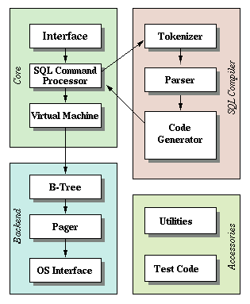

## sql command processor

sqlite는 sql 커맨드 자체를 사용하지 않고 sql 커맨드를 내부에서 bytecode로 바꿔서 처리한다. (sql command processor)

이와같이 raw sql을 바로 처리하지 않는 것에 몇가지 이점이 존재하는데

- 복잡성을 줄여준다
    - 위 사진을 보면 sql command processor가 bytecode을 생성해서 virtual machine으로 전달해준다. 이러면 sql 파싱등을 sql command processor에서 신경써야되므로 virtual machine은 깨끗한 bytecode만 신경쓰면 된다.
- 자주쓰는 쿼리 캐쉬
  - sql command processor에서 자주쓰는 쿼리의 bytecode를 캐싱하여 속도 이점을 얻을 수 있다.

